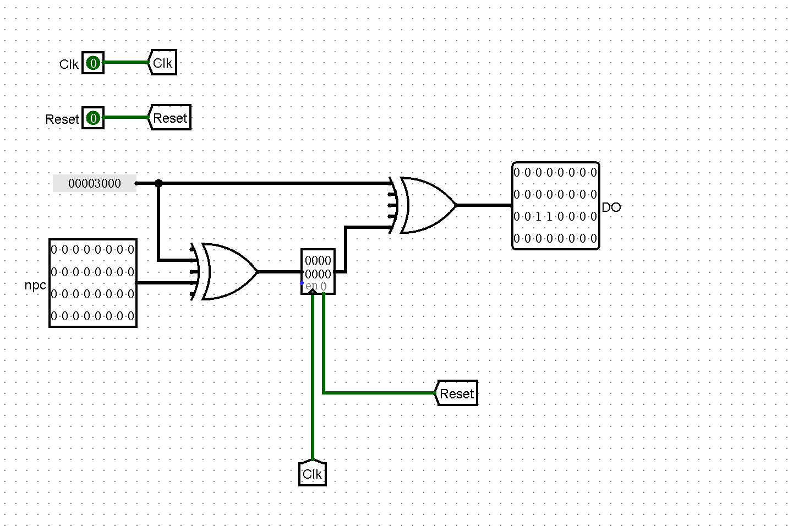
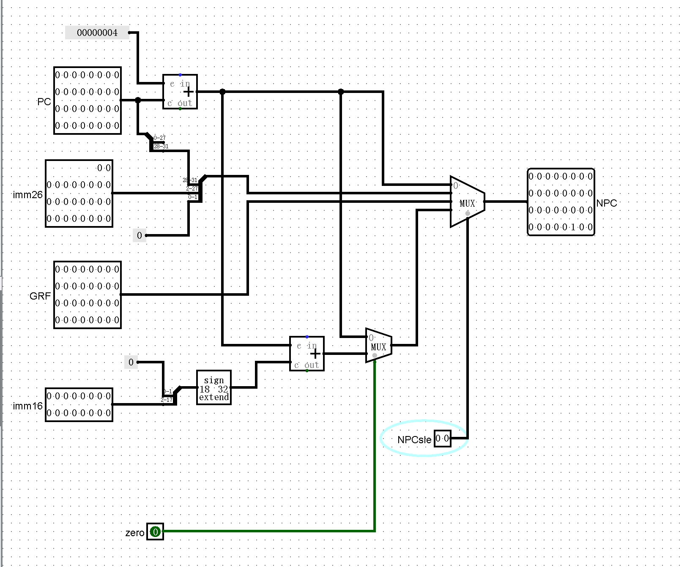
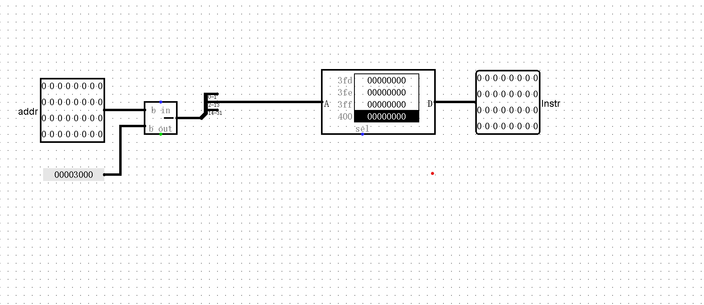
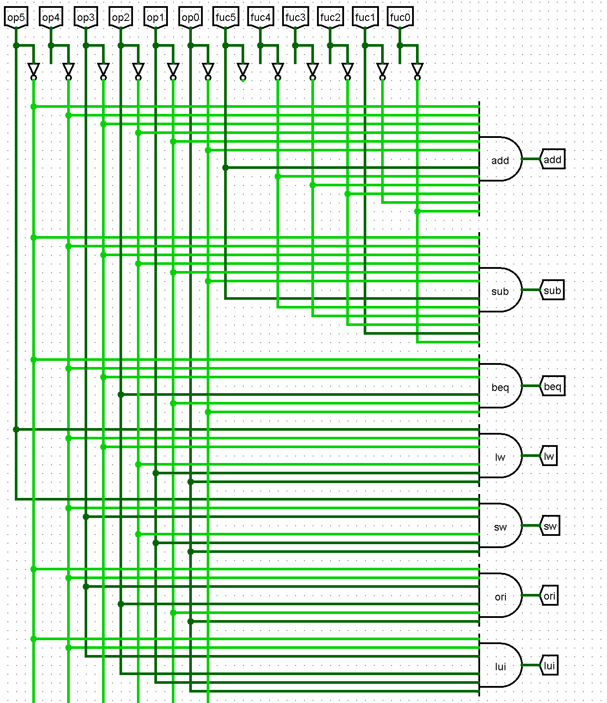

## 整体器件说明

| 中文     | 英文                | 缩写 |
|--------|---------------------|------|
| 数据存储器  | Data Memory         | DM   |
| 指令存储器  | Instruction Memory  | IM   |
| 寄存器堆   | Register File       | RF   |
| 程序计数器  | Program Counter     | PC   | 
|  下指令地址 | Next PC             | NPC  |
| 扩展单元   | Extender            | EXT  |
| 算数逻辑单元 | Arithmetic Logic Unit | ALU  |

## 关键模块定义

### RF (寄存器堆)
**端口说明**

| 信号名称 | 方向 | 功能描述 |
| --------- | ------- | ----------------|
| clk | I | 时钟信号 |
| reset | I | 复位信号，将32个寄存器的值清0. 1：复位 0：无效 |
| WE | I |写能信号 1：可以写入 0:不能写入 |
| A1[4:0] | I | 5位地址输入信号，指定32个寄存器中的一个数据读出到RD1 |
| A2[4:0] | I | 5位地址输入信号，指定32个寄存器中的一个数据读出到RD2 |
| A3[4:0] | I | 5位地址输入信号，指定32个寄存器中的一个作为写入的寄存器 |
| WD[31:0] | I | 32位的数据输入信号 |
| RD1[31:0] | O | 输出A1指定的寄存器中的32位数据 |
| RD2[31:0] | O | 输出A2指定的寄存器中的32位数据 |

### ALU (算数逻辑单元)
**端口说明**

| 信号名称 | 方向 | 功能描述                                      |
| --------- | ------- |-------------------------------------------|
| A[31:0] | I | 32位输入运算数A  00：add,01:sub,10:or,11:compare |
| B[31:0] | I | 32位输入运算数B                                 |
| C[31:0] | O | 32位运算输出结果                                 |
| ALUOp[1:0] | I | 控制信号                                      |
| Zero | O | A = B 置为1，否则置为0                           |
| Less | O | A < B 置为1，否则值为0                           |

### EXT(扩展单元)
**端口说明**

| 信号名称      | 方向 | 功能描述                    |
|-----------| ------- |-------------------------|
| imm[15:0] | I | 16位待扩展数                 |
| Exstyle | I | 00:符号扩展，01:0扩展，10:拓展到高位 |
| B[31:0]   | O | 32位输出   
                |

### PC(程序计数器)
**端口说明**

| 信号名       | 方向 | 功能描述 |
|-----------| ---- |------|
| Clk       | I | 时钟信号 |
| Reset     | I | Reset有效，寄存器置初值为0x00003000 |
| NPC[31:0] | I | 32位输入 |
| PC[31:0]  | O | 32位输出 |

### NPC(下指令地址)
**端口说明**

| 信号名         | 方向 | 描述                                       |
|-------------| --- |------------------------------------------|
| PC[31:0]    | I | 当前指令的地址                                  |
| imm16[15:0] | I | 16位偏移                                    |
| imm26[25:0]  | I | 26位偏移                                    |
| GRF[31:0]   | I | 绝对跳转地址                                   |
| NPCsle[1:0] | I | 00:顺序执行 01：跳转26位立即数 10：跳转GRF 11:跳转16位立即数 |
| zero        | I | 1:rs = rt 0:re != rt                     |
| NPC[31:0]   | O | 下一条指令的地址                                 |

### IM(指令存储器)
**端口说明**

| 信号名          | 方向 | 功能描述 |
|--------------| --- | ---- |
| adress[31:0] | I | 存储器地址(数组下标) |
| Instr[31:0]  | O | 输出指令 |

**内部器件说明**
#### ROM
##### AddressBW12 * DataBW 32 满足4096*32bit
##### spliter 选取2-13位满足12位输入(舍弃0-1位为向右移4位)

### DM(数据存储器)
**端口说明**

| 信号名       | 方向 | 描述      |
|-----------| --- |---------|
| WD[31:0]  | I | 写入的数据   |
| addr[31:0] | I | 带操作的内存地 |
| Wr        | I | 写使能 1:WD可以被写入 0:无法写入 |
| Clk       | I | 时钟,只影响写入，不影响读出 |
| reset     | I | 异步复位信号  |
| D[31:0]   | O | 回写数据 |

### contorl
**端口说明**

| 信号名          | 方向 | 描述             |
|--------------| ---- |----------------|
| fuc[5:0]     | I | 决定指令类型         |
| op[5:0]      | I | 决定指令类型         |
| NPCSle       | O | 选择跳转指令         |
| Regwrite     | O | GRF写使能端        |
| ALUOp[2:0]   | O | ALU执行指令        |
| Extsle       | O | 是否拓展           |
| exstyle[1:0] | O | 拓展类型           |
| RegDst       | O | 选择GRF A3的输入    |
| MemData      | O | 选择GRF WD的输入    |
| MemWrite     | O | DM的写使能端        |
| link         | O | 是否存入跳转地址到ra    |

**控制信号**

|          | add    | sub    | ori    | lui    | lw     | sw     | beq    | j      | jr     | jal    |
|----------|--------|--------|--------|--------|--------|--------|--------|--------|--------|--------| 
| op       | 000000 | 000000 | 001101 | 001111 | 100011 | 101011 | 000100 | 000010 | 000000 | 000011 |
| fuc      | 100000 | 100010 | xxxxxx | xxxxxx | xxxxxx | xxxxxx | xxxxxx | xxxxxx | 001000 | xxxxxx |
| RegWrite | 1      | 1      | 1      | 1      | 1      | 0      | 0      | 0      | 0      | 1      |
| ALUOp    | 00     | 01     | 10     | 00     | xx     | xx     | xx     | xx     | xx     | xx     |
| RegDst   | 01     | 01     | 00     | 00     | 00     | 00     | 00     | xx     | xx     | 10     |
| NPCsle   | 00     | 00     | 00     | 00     | 00     | 00     | 11     | 01     | 10     | 01     |
| Extsle   | 0      | 0      | 1      | 1      | 1      | 1      | x      | x      | x      | x      |
| exstyle  | 00     | 00     | 01     | 10     | 00     | 00     | 00     | 00     | 00     | 00     |
| MemData  | x      | x      | x      | x      | 1      | x      | x      | x      | x      | x      |
| MemWrite | 0      | 0      | 0      | 0      | 0      | 1      | 0      | 0      | 0      | 0      |
| link     | 0      | 0      | 0      | 0      | 0      | 0      | x      | x      | x      | 1      |

#### 与部分
##### 通过与门判断指令类型

##### 通过或门判断控制信号

#### 思考题：
##### 1.单周期CPU中，PC,IM,GRF,DM起到储存作用，NPC起到状态转移的作用
##### 2.合理。IM存储指令，在整个单周期中只需被读取，所以用ROM合适，而DM需要被写入与读出，且需要大量的内存空间所以使用RAM。GRF只需要有32个寄存器即可。
##### 3.NPC单元。NPC单元用于计算下一步地址的位置。分析程序执行时地址的变化。除跳转指令外，NPC在PC基础上加4即可。
##### 4.nop指令对应的机器码为0x00000000,即为sll $0,$0,0,该指令被用于空循环，所以不用加入。
##### 5.我认为测试强度较高，对于add,lui,beq指令的测试全面，但是我认为对于lw,sw的测试不够，对于这两个指令没有考虑到偏移为负数的情况。
