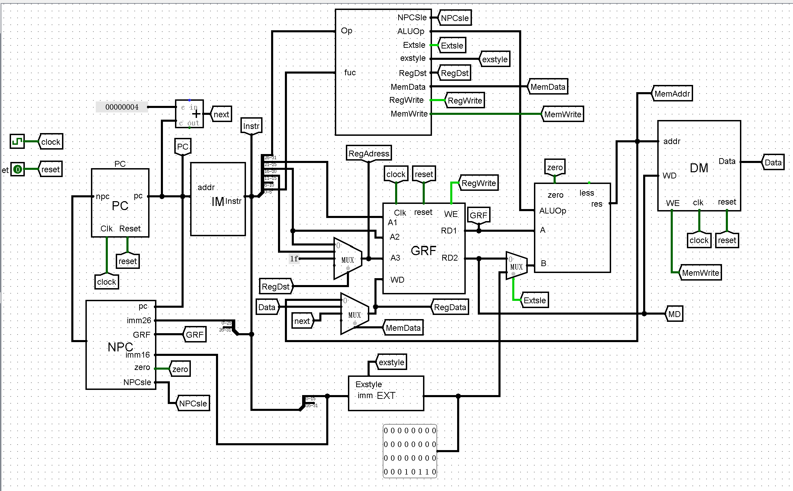
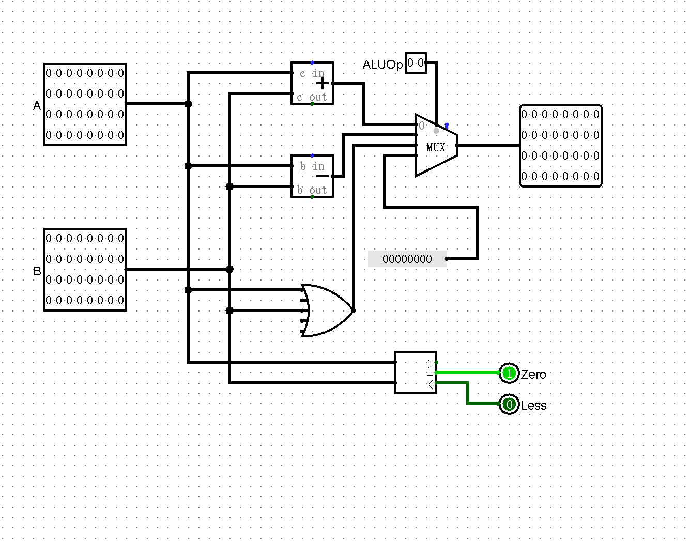
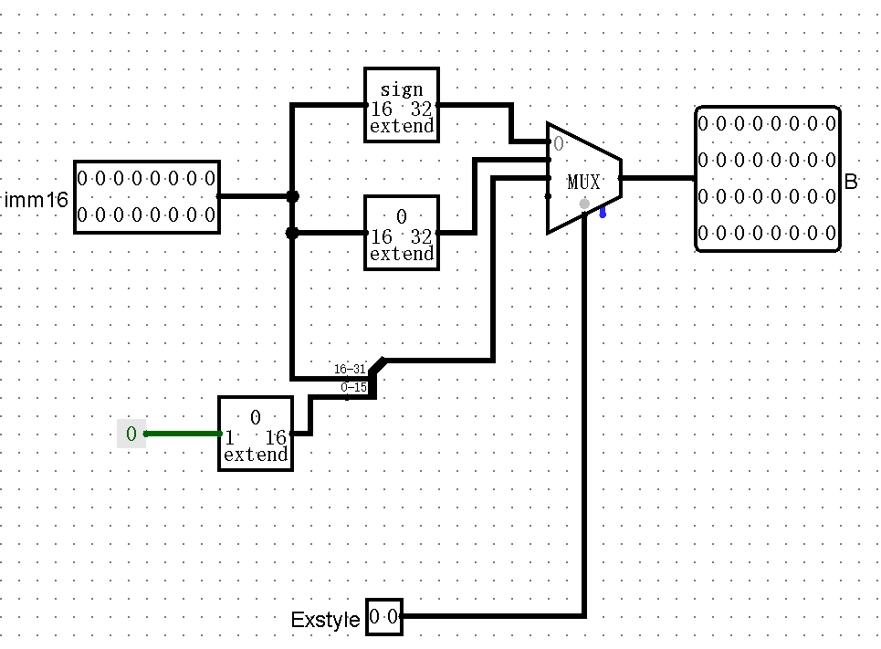
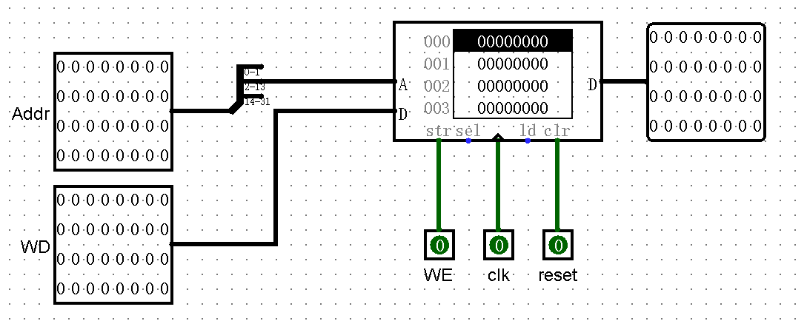

## 整体器件说明

| 中文     | 英文                | 缩写 |
|--------|---------------------|------|
| 数据存储器  | Data Memory         | DM   |
| 指令存储器  | Instruction Memory  | IM   |
| 寄存器堆   | Register File       | RF   |
| 程序计数器  | Program Counter     | PC   | 
|  下指令地址 | Next PC             | NPC  |
| 扩展单元   | Extender            | EXT  |
| 算数逻辑单元 | Arithmetic Logic Unit | ALU  |



## 关键模块定义

### RF (寄存器堆)
**端口说明**

| 信号名称 | 方向 | 功能描述 |
| --------- | ------- | ----------------|
| clk | I | 时钟信号 |
| reset | I | 同步复位信号，将32个寄存器的值清0. 1：复位 0：无效 |
| WE | I |写能信号 1：可以写入 0:不能写入 |
| A1[4:0] | I | 5位地址输入信号，指定32个寄存器中的一个数据读出到RD1 |
| A2[4:0] | I | 5位地址输入信号，指定32个寄存器中的一个数据读出到RD2 |
| A3[4:0] | I | 5位地址输入信号，指定32个寄存器中的一个作为写入的寄存器 |
| WD[31:0] | I | 32位的数据输入信号 |
| RD1[31:0] | O | 输出A1指定的寄存器中的32位数据 |
| RD2[31:0] | O | 输出A2指定的寄存器中的32位数据 |

### ALU (算数逻辑单元)
**端口说明**

| 信号名称 | 方向 | 功能描述                                      |
| --------- | ------- |-------------------------------------------|
| A[31:0] | I | 32位输入运算数A  00：add,01:sub,10:or,11:compare |
| B[31:0] | I | 32位输入运算数B                                 |
| C[31:0] | O | 32位运算输出结果                                 |
| ALUOp[1:0] | I | 控制信号                                      |
| Zero | O | A = B 置为1，否则置为0                           |
| Less | O | A < B 置为1，否则值为0                           |



### EXT(扩展单元)
**端口说明**

| 信号名称      | 方向 | 功能描述                    |
|-----------| ------- |-------------------------|
| imm[15:0] | I | 16位待扩展数                 |
| Exstyle | I | 00:符号扩展，01:0扩展，10:拓展到高位 |
| B[31:0]   | O | 32位输出   
                


### PC(程序计数器)
**端口说明**

| 信号名       | 方向 | 功能描述 |
|-----------| ---- |------|
| Clk       | I | 时钟信号 |
| Reset     | I | 同步复位，Reset有效，寄存器置初值为0x00003000 |
| NPC[31:0] | I | 32位输入 |
| PC[31:0]  | O | 32位输出 |


### NPC(下指令地址)
**端口说明**

| 信号名         | 方向 | 描述                                       |
|-------------| --- |------------------------------------------|
| PC[31:0]    | I | 当前指令的地址                                  |
| imm16[15:0] | I | 16位偏移                                    |
| imm26[25:0]  | I | 26位偏移                                    |
| GRF[31:0]   | I | 绝对跳转地址                                   |
| NPCsle[2:0] | I | 000:顺序执行 001：跳转26位立即数 010：跳转GRF 011:beq跳转指令 |
| zero        | I | 1:rs = rt 0:re != rt                     |
| NPC[31:0]   | O | 下一条指令的地址                                 |


### IM(指令存储器)
**端口说明**

| 信号名          | 方向 | 功能描述 |
|--------------| --- | ---- |
| adress[31:0] | I | 存储器地址(数组下标) |
| Instr[31:0]  | O | 输出指令 |


**内部器件说明**
#### ROM
##### AddressBW12 * DataBW 32 满足4096*32bit
##### spliter 选取2-13位满足12位输入(舍弃0-1位为向右移4位)


### DM(数据存储器)
**端口说明**

| 信号名       | 方向 | 描述      |
|-----------| --- |---------|
| WD[31:0]  | I | 写入的数据   |
| addr[31:0] | I | 要操作的内存地址 |
| Wr        | I | 写使能 1:WD可以被写入 0:无法写入 |
| Clk       | I | 时钟,只影响写入，不影响读出 |
| reset     | I | 异步复位信号  |
| D[31:0]   | O | 回写数据 |



### contorl
**端口说明**

| 信号名          | 方向 | 描述             |
|--------------| ---- |----------------|
| fuc[5:0]     | I | 决定指令类型         |
| op[5:0]      | I | 决定指令类型         |
| NPCSle[2:0]  | O | 选择跳转指令         |
| Regwrite     | O | GRF写使能端        |
| ALUOp[2:0]   | O | ALU执行指令        |
| Extsle       | O | 是否拓展           |
| exstyle[1:0] | O | 拓展类型           |
| RegDst       | O | 选择GRF A3的输入    |
| MemData[1:0] | O | 选择GRF WD的输入    |
| MemWrite     | O | DM的写使能端        |


**控制信号**

|          | add    | sub    | ori    | lui    | lw     | sw     | beq    | j      | jr     | jal    |
|----------|--------|--------|--------|--------|--------|--------|--------|--------|--------|--------| 
| op       | 000000 | 000000 | 001101 | 001111 | 100011 | 101011 | 000100 | 000010 | 000000 | 000011 |
| fuc      | 100000 | 100010 | xxxxxx | xxxxxx | xxxxxx | xxxxxx | xxxxxx | xxxxxx | 001000 | xxxxxx |
| RegWrite | 1      | 1      | 1      | 1      | 1      | 0      | 0      | 0      | 0      | 1      |
| ALUOp    | 00     | 01     | 10     | 00     | xx     | xx     | xx     | xx     | xx     | xx     |
| RegDst   | 01     | 01     | 00     | 00     | 00     | 00     | 00     | xx     | xx     | 10     |
| NPCsle   | 000    | 000    | 000    | 000    | 000    | 000    | 011    | 001    | 010    | 001    |
| Extsle   | 0      | 0      | 1      | 1      | 1      | 1      | x      | x      | x      | x      |
| exstyle  | 00     | 00     | 01     | 10     | 00     | 00     | 00     | 00     | 00     | 00     |
| MemData  | 00     | 00     | 00     | 00     | 01     | 00     | 00     | 00     | 00     | 10     |
| MemWrite | 0      | 0      | 0      | 0      | 0      | 1      | 0      | 0      | 0      | 0      |

### 线路命名：
#### PC 与 NPC：
1. pc_pc(PC的输出，IM的输入) 
2. pc_npc(PC的输入，连接PC与NPC) 
3. pc_pcplus4(PC输出加4，jal跳转时存入$31)

#### IM：
1. im_instr(IM中对应指令)

#### GRF：
1. grf_a1(GRF的A1输入，为im_rs)
2. grf_a2(GRF的A2输入，为im_rt)
3. grf_a3(GRF的A3输入，根据RegDst选择im_rt,im_rd,31输入)
4. grf_wd(GRF的WD输入，根据MemData和link选择alu_res,dm_data,pc_pcplus4输入)
5. grf_rd1(GRF的输出，同时是ALU的A输入)
6. grf_rd2(GRF的输出，同时作为DM的WD输入)

#### ALU:
1. alu_b(ALU的第二个输入，根据Extsle选择grf_rd2,ext_out输入)
2. alu_res(ALU的结果，作为DM的操作地址输入)
3. alu_zero(作为NPC的输入)

#### DM：
1. dm_data(DM取出的数据)

#### ext
1. ext_out(扩展结果)

## 思考题
1. DM的addr输入是ALU的计算结果，选择[11:2]是因为DM是按字地址访问的，每个字站4个字节，所以需要将输入左移两位，得到正确的字地址
2. 
方式1:
```
assign RegWrite = (add | sub | ori | lui | lw | jal) ? 1'b1 : 1'b0；
```
方式2：
```
case(order):
           add: begin
                RegWrite = 1;
                RegDst = 1;
            end
        endcase
```            
###### 第一种方法聚焦于每一个控制信号，第二种方法聚焦于每一种指令的控制信号的选取，第二种方法更有利于拓展           
3. 异步复位中clk于reset是同一优先级，同步复位中clk的优先级高于reset
4. MIPS中addi与add在发生加法溢出时会抛出异常，而addiu与addu则会忽略加法的溢出，所以在忽略溢出的情况下，addi与addiu等价，add与addu等价