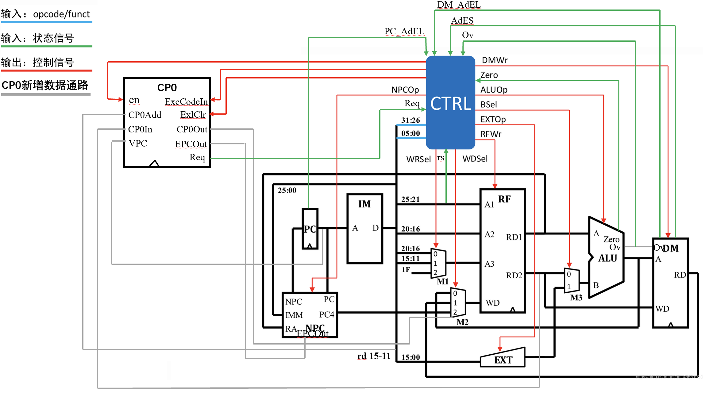
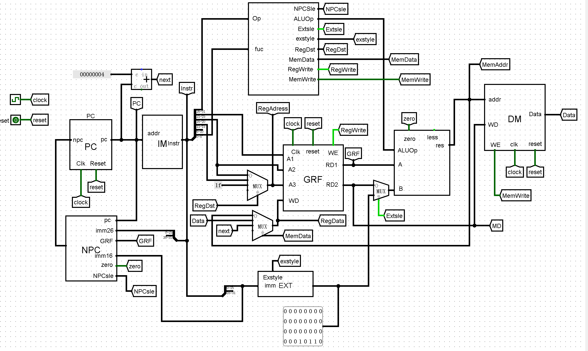

## 整体器件说明

| 中文    | 英文                | 缩写 |
|--------|---------------------|------|
| 数据存储器  | Data Memory         | DM   |
| 指令存储器  | Instruction Memory  | IM   |
| 寄存器堆   | Register File       | RF   |
| 程序计数器  | Program Counter     | PC   | 
|  下指令地址 | Next PC             | NPC  |
| 扩展单元   | Extender            | EXT  |
| 算数逻辑单元 | Arithmetic Logic Unit | ALU  |
| 协处理器 | 无 | CP0 |



## 关键模块定义

### RF (寄存器堆)
**端口说明**

| 信号名称      | 方向 | 功能描述 |
|-----------| ------- | ----------------|
| clk       | I | 时钟信号 |
| reset     | I | 同步复位信号，将32个寄存器的值清0. 1：复位 0：无效 |
| WE        | I |写能信号 1：可以写入 0:不能写入 |
| A1[4:0]   | I | 5位地址输入信号，指定32个寄存器中的一个数据读出到RD1 |
| A2[4:0]   | I | 5位地址输入信号，指定32个寄存器中的一个数据读出到RD2 |
| A3[4:0]   | I | 5位地址输入信号，指定32个寄存器中的一个作为写入的寄存器 |
| WD[31:0]  | I | 32位的数据输入信号 |
| RD1[31:0] | O | 输出A1指定的寄存器中的32位数据 |
| RD2[31:0] | O | 输出A2指定的寄存器中的32位数据 |

### ALU(算数逻辑单元)
**端口说明**
| 信号名称 | 方向 | 功能描述                                      |
| --------- | ------- |-------------------------------------------|
| A[31:0] | I | 32位输入运算数A  00：add,01:sub,10:or,11:compare |
| B[31:0] | I | 32位输入运算数B                                 |
| C[31:0] | O | 32位运算输出结果                                 |
| ALUOp[1:0] | I | 控制信号                                      |
| Zero | O | A = B 置为1，否则置为0                           |
| Less | O | A < B 置为1，否则值为0                           |
| overflow | O | 判断计算是否发生溢出 1:发生溢出 0：未发生溢出 |

### EXT(扩展单元)
**端口说明**

| 信号名称      | 方向 | 功能描述                    |
|-----------| ------- |-------------------------|
| imm[15:0] | I | 16位待扩展数                 |
| Exstyle   | I | 00:符号扩展，01:0扩展，10:拓展到高位 |
| B[31:0]   | O | 32位输出  |

### PC(程序计数器)
**端口说明**

| 信号名       | 方向 | 功能描述 |
|-----------| ---- |------|
| Clk       | I | 时钟信号 |
| Reset     | I | 同步复位，Reset有效，寄存器置初值为0x00003000 |
| NPC[31:0] | I | 32位输入 |
| PC[31:0]  | O | 32位输出 |
| AdEL      | o | 判断取址是否异常  1:异常 0:正常|


### NPC(下指令地址)
**端口说明**

| 信号名           | 方向 | 描述                                       |
|---------------| --- |------------------------------------------|
| PC[31:0]      | I | 当前指令的地址                                  |
| imm16[15:0]   | I | 16位偏移                                    |
| imm26[25:0]   | I | 26位偏移                                    |
| GRF[31:0]     | I | 绝对跳转地址                                   |
| EPCOut[31:0]  | I | 异常结束跳转地址 |
| NPCsle[2:0]   | I | 000:顺序执行 001：跳转26位立即数 010：跳转GRF 011:beq跳转指令 100:跳转到EPCOut位置 101:跳转到异常处理位置(32'h00004180)|
| zero          | I | 1:rs = rt 0:re != rt                     |
| NPC[31:0]     | O | 下一条指令的地址                                 |

### IM(指令存储器)
**端口说明**

| 信号名          | 方向 | 功能描述 |
|--------------| --- | ---- |
| adress[31:0] | I | 存储器地址(数组下标) |
| Instr[31:0]  | O | 输出指令 |

**内部器件说明**
#### ROM
##### AddressBW12 * DataBW 32 满足4096*32bit
##### spliter 选取2-13位满足12位输入(舍弃0-1位为向右移4位)

### DM(数据存储器)
**端口说明**

| 信号名        | 方向 | 描述      |
|------------| --- |---------|
| WD[31:0]   | I | 写入的数据   |
| addr[31:0] | I | 要操作的内存地址 |
| Wr         | I | 写使能 1:WD可以被写入 0:无法写入 |
| Clk        | I | 时钟,只影响写入，不影响读出 |
| reset      | I | 异步复位信号  |
| overflow   | I | 计算地址加法溢出信号 |
| D[31:0]    | O | 回写数据 |
| AdEL       | O | lw时地址是否异常 1:异常 0:正常|
| AdES       | O | sw时地址是否异常 1:异常 0:正常|


### CP0(协处理器)
**端口说明**

| 信号名            | 方向 | 描述               |
|----------------| ----- |------------------|
| clk            | I | 时钟信号             |
| reset          | I | 同步复位信号           |
| en             | I | CP0写使能信号         |
| CP0Add[4:0]    | I | 写入\读出寄存器地址       |
| CP0In[31:0]    | I | 写入PC0的数据 |
| VPC[31:0]      | I | 写入受害地址           |
| ExcCodeIn[4:0] | I | 异常类型             |
| EXLClr         | I | EXL复位信号          |
| EPCOut[31:0]   | O | EP               |
| Req            | O | 是否进入异常程序处理 1:进入 0:不进入 |
| CP0Out         | O | CP0读出数据          |

**内部器件说明**

##### SR: SR[1]用于记录是否处于异常处理程序中 1:处于 0:不处于
##### CAUSE: CAUSE[6:2]用于记录ExcCodeIn(异常类型)
##### EPC: 记录受害PC

### contorl
**端口说明**

| 信号名          | 方向 | 描述             |
|--------------| ---- |----------------|
| fuc[5:0]     | I | 决定指令类型         |
| op[5:0]      | I | 决定指令类型         |
| rs[4:0]      | I | 决定指令的类型       |
| overflow     | I | 是否发生计算溢出异常 |
| AdEL_DM      | I | 是否发生lw指令异常   |
| AdES         | I | 是否发生sw指令异常   |
| AdEL_PC      | I | 是否发生PC异常       |
| Req          | I | 是否进入异常处理程序 1:进入 0:进入 |
| NPCSle[2:0]  | O | 选择跳转指令         |
| Regwrite     | O | GRF写使能端        |
| ALUOp[2:0]   | O | ALU执行指令        |
| Extsle       | O | 是否拓展           |
| exstyle[1:0] | O | 拓展类型           |
| RegDst       | O | 选择GRF A3的输入    |
| MemData[2:0] | O | 选择GRF WD的输入    |
| MemWrite     | O | DM的写使能端        |
| ExcCodeIn[4:0] | O | 异常指令异常码    |
| en           | O | CP0写使能 1:能写入 0:不能写入 |
| EXLClr       | O | EXL复位信号 |

**控制信号**

|           | add    | sub    | ori    | lui    | lw     | sw     | beq    | j      | jr     | jal    | mtc0   | mfco   | eret   | syscall |
|-----------|--------|--------|--------|--------|--------|--------|--------|--------|--------|--------|--------|--------|--------|---------|
| op        | 000000 | 000000 | 001101 | 001111 | 100011 | 101011 | 000100 | 000010 | 000000 | 000011 | 010000 | 010000 | 010000 | 000000  |
| fuc       | 100000 | 100010 | xxxxxx | xxxxxx | xxxxxx | xxxxxx | xxxxxx | xxxxxx | 001000 | xxxxxx | xxxxxx | xxxxxx | 011000 | 001100  |
| rs        | xxxxx  | xxxxx  | xxxxx  | xxxxx  | xxxxx  | xxxxx  | xxxxx  | xxxxx  | xxxxx  | xxxxx  | 00100  | 00000  | xxxxx  | xxxxx   |
| RegWrite  | 1      | 1      | 1      | 1      | 1      | 0      | 0      | 0      | 0      | 1      | 0      | 1      | 0      | 0       |
| ALUOp     | 00     | 01     | 10     | 00     | xx     | xx     | xx     | xx     | xx     | xx     | xx     | 00     | xx     | xx      |
| RegDst    | 01     | 01     | 00     | 00     | 00     | 00     | 00     | xx     | xx     | 10     | xx     | 00     | xx     | xx      | 
| NPCsle    | 000    | 000    | 000    | 000    | 000    | 000    | 011    | 001    | 010    | 001    | 000    | 000    | 100    | xxx     |
| Extsle    | 0      | 0      | 1      | 1      | 1      | 1      | x      | x      | x      | x      | 0      | 0      | 0      | 0       |
| exstyle   | 00     | 00     | 01     | 10     | 00     | 00     | 00     | 00     | 00     | 00     | 00     | 00     | 00     | 00      |
| MemData   | 000    | 000    | 000    | 000    | 001    | 000    | 000    | 000    | 000    | 010    | 000    | 011    | 000    | 000     |
| MemWrite  | 0      | 0      | 0      | 0      | 0      | 1      | 0      | 0      | 0      | 0      | 0      | 0      | 0      | 0       |
| en        | 0      | 0      | 0      | 0      | 0      | 0      | 0      | 0      | 0      | 0      | 1      | 0      | 0      | 0       |
| EXLClr    | 0      | 0      | 0      | 0      | 0      | 0      | 0      | 0      | 0      | 0      | 0      | 0      | 1      | 0       |

##### 异常说明
| 异常码  | 名称      | 指令类型     | 描述                                            |
|------|---------|----------|-----------------------------------------------|
| 4    | AdEL    | 所有指令     | PC 地址未字对齐。/PC 地址不在 0x3000 ~ 0x6ffc范围内。        |
| 4    | AdEL    | lw       | 取数地址没有字对齐。/计算地址时加法溢出 。/取数地址超出0x0000 ~ 0x2fff。 |
| 5    | AdES    | sw       | 存数地址没有字对齐。/计算地址时加法溢出。/存数地址超出0x0000 ~ 0x2fff。  |
| 8    | Syscall | syscall  | 系统调用。                                         |
| 10   | RI      | -        | 未知的指令码。                                       |
| 12   | Ov      | add,sub  | 算术溢出。                                         |

### 线路命名：
#### PC 与 NPC：
1. pc_pc(PC的输出，IM的输入) 
2. pc_npc(PC的输入，连接PC与NPC) 
3. pc_pcplus4(PC输出加4，jal跳转时存入$31)
4. AdEL_PC(PC中是否出现取值异常，传入control)

#### IM：
1. im_instr(IM中对应指令)

#### GRF：
1. grf_a1(GRF的A1输入，为im_rs)
2. grf_a2(GRF的A2输入，为im_rt)
3. grf_a3(GRF的A3输入，根据RegDst选择im_rt,im_rd,31输入)
4. grf_wd(GRF的WD输入，根据MemData和link选择alu_res,dm_data,pc_pcplus4输入)
5. grf_rd1(GRF的输出，同时是ALU的A输入)
6. grf_rd2(GRF的输出，同时作为DM的WD输入)

#### ALU:
1. alu_b(ALU的第二个输入，根据Extsle选择grf_rd2,ext_out输入)
2. alu_res(ALU的结果，作为DM的操作地址输入)
3. alu_zero(作为NPC的输入)

#### DM：
1. dm_data(DM取出的数据)

#### ext
1. ext_out(扩展结果)

#### cp0
1. cp0_en(cp0写使能，接受control信号)
2. cp0_exccodein(异常类型，接受control信号)
3. cp0_exclr(EXL复位，接受control信号)
4. cp0_epcout(输出VPC，连接cp0与NPC)
5. cpo_req(输出到control)
6. cp0_cp0out(cp0输出)

## 测试

#### 异常处理程序（0x4180起）

```mips
	ori $6, $6, 1
	ori $2, $2, 2
```

对应的机器码为（txt文件从**第1121行**开始）：

```
34c60001
34420002
```

#### 算术溢出

加法溢出：

```
	ori $3, $3, 2147483647
	ori $4, $4, 1
	add $5, $3, $4
```

减法溢出：

```
	ori $3, $3, -2147483647
	ori $4, $4, 1
	sub $5, $3, $4
```
#### 系统调用异常

```
	ori $1, $1, 2
	syscall
```

#### 未知指令

```
	ori $1, $1, 2
	mfhi $2
```

#### 取指异常

PC 地址异常：

```mips
	ori $1, $1, 0x2000
	jr $1
```

PC 地址未字对齐（通过 `jr` 来实现）：

```
	ori $1, $1, 0x300d
	jr $1
label:
	ori $3, $3, 1
	beq $0, $3, label
```

#### 取数异常（只针对lw）

取数地址没有字对齐：

```
	ori $2, $2, 0x0001
	lw $1, 0($2)
```

计算地址时加法溢出/地址超出：

```
	ori $2, $2, 0xfffffff0
	lw $1, 0xfffffff0($2)
```

#### 存数异常（只针对sw）

存数地址没有字对齐：

```
	ori $2, $2, 0x0001
	sw $1, 0($2)
```

